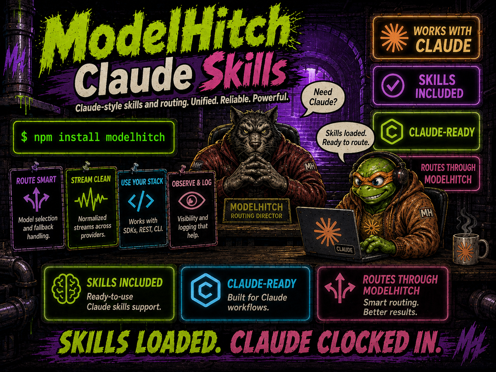

  

# ModelHitch skills for Claude

These project skills are built from ModelHitch source, types, and tests. Claude Code discovers
them automatically when working in this repository.

## Skills

| Skill | Purpose |
| --- | --- |
| [`/modelhitch-integrate`](./modelhitch-integrate/SKILL.md) | TypeScript, React, BYOK, providers, tools, and failover |
| [`/modelhitch-bridge`](./modelhitch-bridge/SKILL.md) | Claude Code, Codex, Gemini, IDE, and bridge operations |

## Reuse

Copy either skill directory into another project's `.claude/skills/` directory or into
`~/.claude/skills/` for personal use. Each skill directory can also be zipped individually for
Claude.ai upload.

The application library supports Node.js 18+. The packaged ModelHitch bridge requires Node.js
22.5+ because SQLite usage persistence is enabled.
