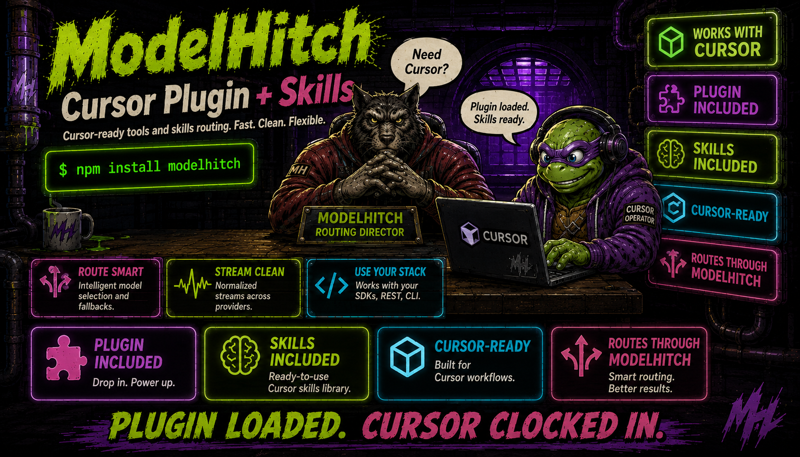

<p align="center">
  
</p>

# ModelHitch for Cursor

Fastest personal skill install:

```bash
npx modelhitch setup cursor
```

[](../plugins/modelhitch/README.md)
[](../plugins/modelhitch/.cursor-plugin/plugin.json)
[](../plugins/modelhitch/skills/modelhitch/SKILL.md)

This directory is the Cursor multi-plugin marketplace entrypoint. The catalog resolves the
ModelHitch package under `plugins/modelhitch/`, where Cursor loads its manifest and the shared
skill.

## Local development

```bash
cursor-agent --plugin-dir ./plugins/modelhitch
```

For the Cursor IDE, copy the plugin directory to `~/.cursor/plugins/local/modelhitch`, then run
**Developer: Reload Window**.

## Publish

Submit the public repository through the
[Cursor Marketplace publisher](https://cursor.com/marketplace/publish). Cursor reviews every
marketplace plugin before listing it.
