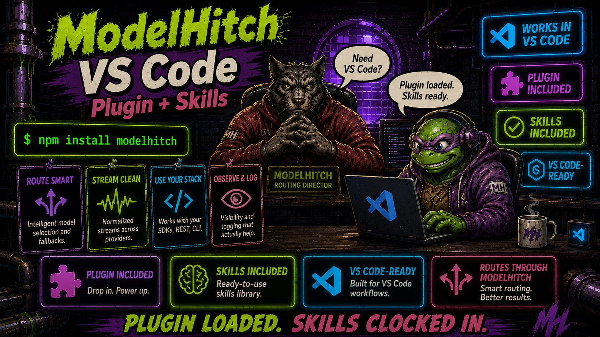

<p align="center">
  
</p>

# ModelHitch for VS Code and GitHub Copilot

[](../../plugins/modelhitch/README.md)
[](../../plugins/modelhitch/plugin.json)
[](../../plugins/modelhitch/skills/modelhitch/SKILL.md)

This is the GitHub Copilot marketplace entrypoint. It distributes the portable Agent Plugins 1.0
package in `plugins/modelhitch/` to Copilot CLI, GitHub Copilot in VS Code, and Copilot cloud
agent.

## Install

```bash
copilot plugin marketplace add genoventures-labs/ModelHitch
copilot plugin install modelhitch@modelhitch
```

VS Code automatically discovers plugins installed by Copilot CLI. Alternatively, use
**Chat: Install Plugin From Source** and provide this repository URL.

When working inside the ModelHitch repository, VS Code also discovers the project skills under
`.claude/skills/` directly.
