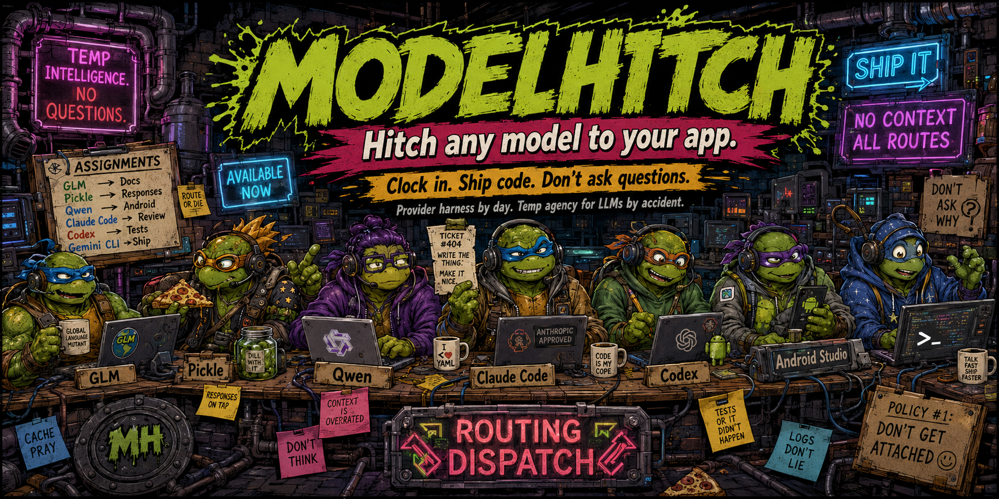
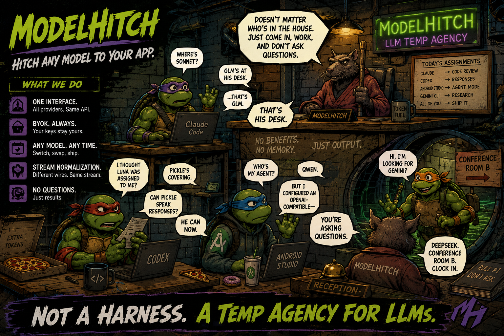
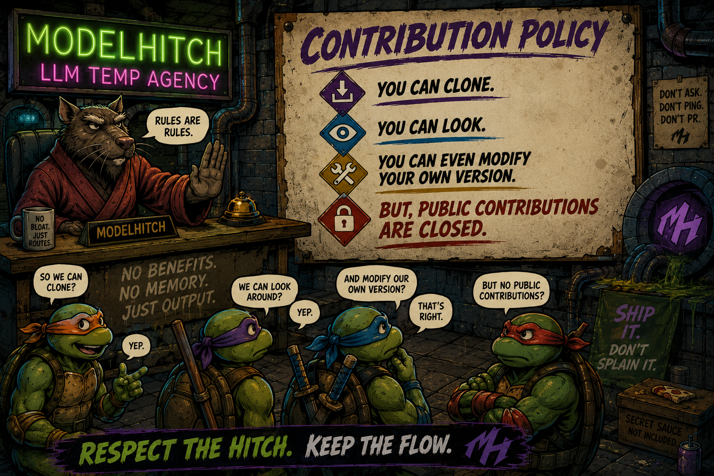
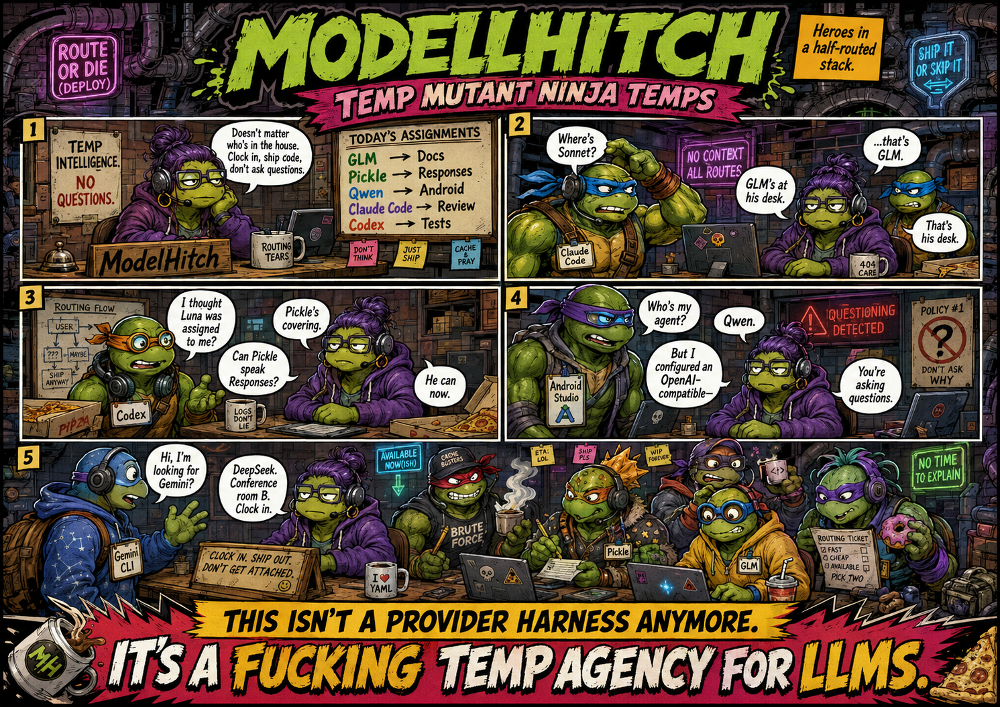
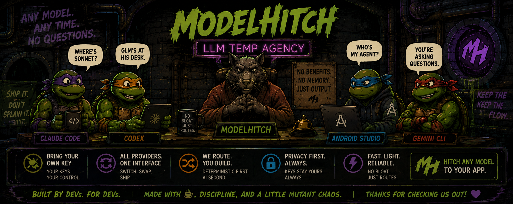

<p align="center">
  
</p>

<p align="center">
  <strong>Hitch any model to your app.</strong><br/>
  Clock in. Ship code. Do not ask questions.
</p>

<p align="center">
  <a href="#quickstart">Quickstart</a> ·
  <a href="#providers">Providers</a> ·
  <a href="#agent-bridge">Agent bridge</a> ·
  <a href="#development">Development</a>
</p>

> Provider harness by day. Temp agency for LLMs by accident.

ModelHitch is a small TypeScript BYOK integration layer. Integrate one interface, let users
bring their own keys, and route requests to the provider or model that fits the job.

## The desk

<p align="center">
  
</p>

| What you get | What it means |
| --- | --- |
| One interface | `chat()` and `stream()` share the same types across providers. |
| BYOK | Keys can stay in the user's browser and go directly to the provider. |
| Any model | Use hosted gateways, local runtimes, or your own OpenAI-compatible endpoint. |
| One stream | Provider-specific events become normalized `StreamChunk` events. |
| Tool calling | Declare tools once and use them across supported adapters. |
| No bloat | Node >=18, browsers, and edge runtimes. |

## Quickstart

```bash
npm install modelhitch
```

```ts
import { ModelHitch } from 'modelhitch';

const mh = new ModelHitch();

const result = await mh.chat({
  provider: 'opencode-zen',
  model: 'big-pickle',
  messages: [{ role: 'user', content: 'Hello from the temp agency.' }],
});

console.log(result.message.content);
```

Streaming uses the same request shape and normalized events everywhere:

```ts
const stream = await mh.stream({
  provider: 'opencode-go',
  model: 'deepseek-v4-flash',
  messages: [{ role: 'user', content: 'Write a haiku about hitches.' }],
});

for await (const chunk of stream) {
  if (chunk.type === 'text-delta') process.stdout.write(chunk.text);
}
```

## Providers

ModelHitch ships with hosted, local, and deterministic providers:

| Provider id | Default endpoint | Key env var |
| --- | --- | --- |
| `opencode-zen` | OpenCode Zen | `OPENCODE_ZEN_API_KEY` |
| `opencode-go` | OpenCode Go | `OPENCODE_GO_API_KEY` |
| `openai` | OpenAI | `OPENAI_API_KEY` |
| `anthropic` | Anthropic | `ANTHROPIC_API_KEY` |
| `groq` | Groq | `GROQ_API_KEY` |
| `openrouter` | OpenRouter | `OPENROUTER_API_KEY` |
| `together` | Together AI | `TOGETHER_API_KEY` |
| `lmstudio` | Local LM Studio | - |
| `ollama` | Local Ollama | - |
| `vllm` | Local vLLM | - |
| `llamacpp` | Local llama.cpp | - |
| `koboldcpp` | Local KoboldCpp | - |
| `mock` | Deterministic test provider | - |

The OpenCode gateways also accept `OPENCODE_API_KEY` as a fallback. Zen automatically selects
the wire protocol by model family:

| Model family | Protocol |
| --- | --- |
| `gpt-*`, `grok-*` | OpenAI Responses |
| `claude-*`, `qwen*` | Anthropic Messages |
| `gemini-*` | Google GenerateContent |
| Everything else | OpenAI-compatible chat completions |

Use live discovery when you need the current gateway catalog:

```ts
const models = await mh.listModels('opencode-zen');
```

## Bring your own key

Keys resolve in this order:

1. Explicit `apiKey` or `baseUrl` on the request
2. The configured `KeyStore`
3. The provider environment variable

For browser applications, `LocalStorageKeyStore` keeps the key on the user's device:

```ts
import { LocalStorageKeyStore, ModelHitch } from 'modelhitch';

const mh = new ModelHitch({ keystore: new LocalStorageKeyStore() });
await mh.keystore!.set('opencode-zen', userPastedKey);

const result = await mh.chat({
  provider: 'opencode-zen',
  model: 'big-pickle',
  messages: [{ role: 'user', content: 'Ship it.' }],
});
```

`MemoryKeyStore` is available for server-side use. Your backend does not need to proxy a
browser user's provider key.

## Tools and agent loops

Declare a provider-agnostic tool once:

```ts
const result = await mh.chat({
  provider: 'opencode-go',
  messages: [{ role: 'user', content: 'What is the weather in Tokyo?' }],
  tools: [{
    name: 'get_weather',
    description: 'Get current weather for a city',
    parameters: {
      type: 'object',
      properties: { city: { type: 'string' } },
      required: ['city'],
    },
  }],
});

if (result.finishReason === 'tool-calls') {
  for (const call of result.message.toolCalls!) {
    console.log(call.name, call.arguments);
  }
}
```

`runToolLoop` handles streaming, tool execution, and follow-up turns:

```ts
import { runToolLoop } from 'modelhitch';

for await (const event of runToolLoop(
  mh,
  { provider: 'opencode-zen', messages, tools: [weatherTool] },
  async (name, args) => myToolRunner(name, args),
  { maxTurns: 8 },
)) {
  if (event.type === 'chunk' && event.chunk.type === 'text-delta') {
    ui.append(event.chunk.text);
  }
}
```

## React: a BYOK UI in a day

```tsx
import { useChat } from 'modelhitch/react';

function Chat() {
  const { messages, pending, send, reset } = useChat({
    baseUrl: 'http://127.0.0.1:3939/v1',
    model: 'opencode-zen/big-pickle',
    systemPrompt: 'You are a helpful assistant.',
  });

  return /* render messages, pending, send(text), and reset */ null;
}
```

`useStream` is the lower-level hook for one turn. The runnable demo in `examples/byok-ui/`
uses the deterministic mock provider and needs no API key.

## Add your own gateway

OpenAI-compatible APIs are one registration away:

```ts
import { createOpenAICompatibleProvider } from 'modelhitch';

export const myGateway = createOpenAICompatibleProvider({
  id: 'my-gateway',
  name: 'My Gateway',
  baseUrl: 'https://gateway.example.com/v1',
  defaultModel: 'my-model',
  apiKeyEnvVar: 'MY_GATEWAY_API_KEY',
});
```

For another wire format, implement the `Provider` interface: `chat`, `stream`,
`capabilities`, and optionally `listModels`.

## Agent bridge

The local bridge turns ModelHitch into an OpenAI-compatible endpoint for coding agents and IDEs.
Start it with:

```bash
npm run bridge
```

Then point a client at `http://127.0.0.1:3939/v1`. Keys are resolved on the bridge machine;
clients only need a dummy key when their configuration requires one.

```ts
import { createModelHitchServer, OPENCODE_GO_MODELS, OPENCODE_ZEN_MODELS } from 'modelhitch';

const server = createModelHitchServer({
  defaultProviderId: 'opencode-zen',
  staticModels: {
    'opencode-zen': [...OPENCODE_ZEN_MODELS],
    'opencode-go': [...OPENCODE_GO_MODELS],
  },
  logger: console.log,
});

await server.listen(3939, '127.0.0.1');
```

### Who is my agent?

Prefix a model with its provider. Bare ids use the default provider.

| Request | Route |
| --- | --- |
| `opencode-zen/big-pickle` | OpenCode Zen, `big-pickle` |
| `opencode-go/deepseek-v4-flash` | OpenCode Go, `deepseek-v4-flash` |
| `anthropic/claude-sonnet-4-5` | Anthropic, `claude-sonnet-4-5` |
| `ollama/llama3.2` | Local Ollama |
| `big-pickle` | Default provider's `big-pickle` |

The bridge speaks:

| Endpoint | Client family |
| --- | --- |
| `POST /v1/chat/completions` | OpenAI-compatible clients |
| `POST /v1/responses` | Codex CLI and Responses clients |
| `POST /v1/messages` | Claude Code and Anthropic clients |
| `POST /v1beta/models/{model}:generateContent` | Gemini CLI |
| `GET /v1/models`, `GET /healthz` | Discovery and health checks |

Supported harnesses include Codex CLI, Claude Code, Gemini CLI, Aider, Continue, Cline, Roo,
Kilo, Goose, OpenCode CLI, Zed, and any client with a custom OpenAI-compatible endpoint.

<details>
<summary>Codex CLI</summary>

Start the bridge, then add this to `~/.codex/config.toml`:

```toml
model_provider = "modelhitch"
model = "opencode-zen/gpt-5.6-luna"

[model_providers.modelhitch]
name = "ModelHitch local bridge"
base_url = "http://127.0.0.1:3939/v1"
```

</details>

<details>
<summary>Claude Code</summary>

```bash
export ANTHROPIC_BASE_URL="http://127.0.0.1:3939"
export ANTHROPIC_AUTH_TOKEN="local-bridge"
export ANTHROPIC_DEFAULT_SONNET_MODEL="deepseek-v4-flash"
claude
```

</details>

<details>
<summary>Gemini CLI</summary>

```bash
export GOOGLE_GEMINI_BASE_URL="http://127.0.0.1:3939"
export GEMINI_API_KEY="local-bridge"
export GEMINI_MODEL="gemini-3.5-flash-lite"
gemini
```

</details>

The bridge accepts request bodies up to 64 MiB by default for inline images. Set
`MODELHITCH_MAX_BODY_BYTES` to tune the CLI bridge. For opaque upstream failures,
`MODELHITCH_DEBUG=1` logs the forwarded body and full upstream error.

## Errors and usage

```ts
import { ModelHitchError } from 'modelhitch';

try {
  await mh.chat({ provider: 'opencode-zen', messages });
} catch (error) {
  if (error instanceof ModelHitchError) {
    console.log(error.code);
  }
}
```

Stable codes include `missing-api-key`, `invalid-api-key`, `rate-limited`, `model-not-found`,
`provider-not-found`, `provider-error`, `network-error`, and `bad-request`.

Use `onUsage` on the bridge for request metering, or `estimateCost(model, usage, providerId?)`
for best-effort offline estimates. Local providers are free in the estimator.

## Contributing

<p align="center">
  
</p>

The rules are simple: clone it, look around, and modify your own version. Public contributions
are currently closed. No benefits. No memory. Just output.

## Development

```bash
npm install
npm run typecheck
npm test
npm run build
npm run example
npm run bridge
npm run canary
```

`npm run example` uses the deterministic mock provider. `npm run canary` needs a Zen key.

## License

MIT

<p align="center">
  
</p>

<p align="center">
  
</p>
