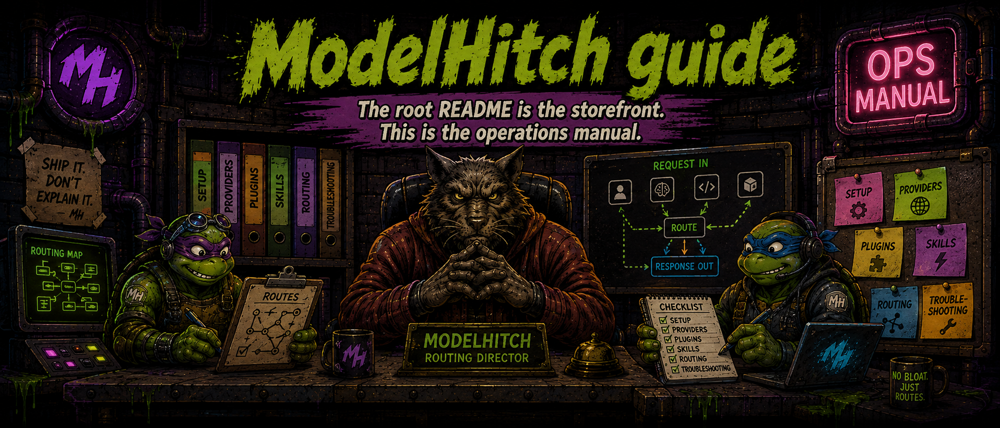

<p align="center"></p>


# ModelHitch guide

The root [README](../README.md) is the storefront. This is the operations manual.

- [Library API](#library-api)
- [Credentials and BYOK](#credentials-and-byok)
- [Web apps (browser)](#web-apps-browser)
- [Tools and React](#tools-and-react)
- [Local agent bridge](#local-agent-bridge)
- [Auto-mode failover](#auto-mode-failover)
- [Usage and persistence](#usage-and-persistence)
- [Errors and custom providers](#errors-and-custom-providers)

## Library API

```ts
import { ModelHitch } from 'modelhitch';

const mh = new ModelHitch({ autoMode: true });

const result = await mh.chat({
  provider: 'mock',
  model: 'mock-model',
  messages: [{ role: 'user', content: 'Clock in.' }],
});

for await (const chunk of await mh.stream({
  provider: 'opencode-go',
  model: 'deepseek-v4-flash',
  messages: [{ role: 'user', content: 'Stream it.' }],
})) {
  if (chunk.type === 'text-delta') process.stdout.write(chunk.text);
}
```

Useful methods include `chat`, `stream`, `streamToResult`, `provider`, `capabilities`, and
`listModels`. Use `mock/mock-model` for deterministic tests without credentials.

## Credentials and BYOK

Credentials resolve in this order:

1. Explicit request `apiKey` or `baseUrl`
2. Configured keystore
3. Provider environment variable

Use `LocalStorageKeyStore` for browser-owned keys and `MemoryKeyStore` or environment variables on
the server. Never put a server credential in a browser bundle.

| Provider | Environment variable |
| --- | --- |
| OpenCode Zen | `OPENCODE_ZEN_API_KEY`, fallback `OPENCODE_API_KEY` |
| OpenCode Go | `OPENCODE_GO_API_KEY`, fallback `OPENCODE_API_KEY` |
| OpenAI | `OPENAI_API_KEY` |
| Anthropic | `ANTHROPIC_API_KEY` |
| Groq | `GROQ_API_KEY` |
| OpenRouter | `OPENROUTER_API_KEY` |
| Together | `TOGETHER_API_KEY` |
| HuggingFace | `HF_TOKEN` |
| Google Gemini | `GEMINI_API_KEY` |
| DeepSeek | `DEEPSEEK_API_KEY` |
| xAI | `XAI_API_KEY` |
| Mistral | `MISTRAL_API_KEY` |
| Moonshot | `MOONSHOT_API_KEY` |
| Z.ai (GLM) | `ZAI_API_KEY` |

Local providers and `mock` require no key by default.

## Web apps (browser)

The library ships a browser entry. Bundlers (Vite, webpack, esbuild, Rollup) resolve the `browser`
export condition automatically, so `import { ModelHitch } from 'modelhitch'` in a web app loads the
browser build — no Node polyfills required. You can also import from the dedicated entry explicitly:

```ts
import { ModelHitch } from 'modelhitch/browser';
```

The browser entry exposes the full library surface (client, providers, keystores, agent tool loop,
failover, usage tracking, stream helpers, types) minus the Node-only bridge server and SQLite usage
storage, which are never included in the browser bundle.

### Direct BYOK

The direct-BYOK pattern keeps keys on the user's device — never ship a server key in a browser bundle:

```ts
import { ModelHitch, LocalStorageKeyStore } from 'modelhitch';

const mh = new ModelHitch({ keystore: new LocalStorageKeyStore() });
await mh.keystore?.set('openai', userPastedKey); // stored in localStorage only
const result = await mh.chat({
  provider: 'openai',
  messages: [{ role: 'user', content: 'Hello' }],
});
```

Keys stay in `localStorage` on the user's device and are read straight from the keystore on each call.

### CORS notes

Provider APIs that accept browser-origin calls without extra setup: OpenAI, OpenRouter, Groq,
Together, DeepSeek, Mistral, xAI, Moonshot, Z.ai (GLM), HuggingFace, and OpenCode Zen/Go.

Anthropic rejects browser-origin requests unless the request carries the
`anthropic-dangerous-direct-browser-access: true` header. Pass `dangerouslyAllowBrowser: true` to
the provider options to send it:

```ts
import { createAnthropicProvider } from 'modelhitch';

const anthropic = createAnthropicProvider({ dangerouslyAllowBrowser: true });
```

Local runtimes (Ollama, LM Studio, vLLM, llama.cpp, KoboldCpp) must be reachable from the page's
origin with CORS enabled — usually a dev-only setup via `localhost`. `mockProvider` works fully
offline and needs no key, which makes it handy for demos.

### React and Node-only pieces

The React hooks (`useChat`, `useStream`) and `createBridgeClient` from `modelhitch/react` work
unchanged in browsers. The bridge server and SQLite usage storage are Node-only and are never
included in the browser bundle.

## Tools and React

Use `runToolLoop` when the application must execute model tool calls and submit results. It handles
streaming, execution, and follow-up turns while keeping the provider-neutral message format.

React integrations come from the separate entrypoint:

```tsx
import { useChat } from 'modelhitch/react';

const chat = useChat({
  baseUrl: 'http://127.0.0.1:3939/v1',
  model: 'opencode-zen/big-pickle',
});
```

`useStream` handles a single streaming turn; `createBridgeClient` provides the lower-level client.
The runnable [BYOK UI](../examples/byok-ui) is a reference template: it runs against the published
`modelhitch@^0.14` npm package (no source aliases) and has its own
[README](../examples/byok-ui/README.md) covering both integration patterns, the security model, and
how to adapt it to a new project.

## Local agent bridge

The bridge supports OpenAI-compatible clients, Codex, Claude Code, Gemini CLI, and IDE agents over
their native wires.

```bash
npx modelhitch bridge
npx modelhitch bridge --background
npx modelhitch status
npx modelhitch front
npx modelhitch stop
```

The CLI bridge requires Node.js 22.5+ because SQLite usage persistence is enabled. Verify
`GET /healthz` and `GET /v1/models`, then smoke-test `mock/mock-model` before adding a live key.

| Endpoint | Client family |
| --- | --- |
| `POST /v1/chat/completions` | OpenAI chat clients |
| `POST /v1/responses` | Codex and Responses clients |
| `POST /v1/messages` | Claude and Anthropic clients |
| `POST /v1beta/models/{model}:generateContent` | Gemini clients |
| `GET /v1/models`, `GET /healthz` | Discovery and health |
| `GET /v1/usage`, `GET /usage` | Usage JSON and dashboard |

Use `http://127.0.0.1:3939/v1` for OpenAI-style clients and
`http://127.0.0.1:3939` for clients that append Anthropic or Gemini paths. Route explicit models as
`providerId/modelId`; bare IDs use the default provider.

Some OpenAI-compatible clients (for example, the official `openai` SDK and IDE agents) require a
nonempty `apiKey` field before they will send a request. The bridge resolves credentials locally
and ignores the incoming Authorization header, so you can supply any harmless bridge-local
placeholder such as `sk-bridge-local` — never a real user key — solely to satisfy that client-side
validation.

Environment controls:

| Variable | Default | Purpose |
| --- | --- | --- |
| `MODELHITCH_PORT` | `3939` | Bridge port |
| `MODELHITCH_HOST` | `127.0.0.1` | Bind host |
| `MODELHITCH_MAX_BODY_BYTES` | 64 MiB | Request-body limit |
| `MODELHITCH_HOME` | `~/.modelhitch` | PID and log directory |
| `MODELHITCH_DEBUG` | disabled | Full forwarded-body diagnostics; may expose sensitive content |

Agent-specific setup lives in [examples/codex.config.toml](../examples/codex.config.toml) and the
[ModelHitch skill reference](../plugins/modelhitch/skills/modelhitch/references/api-and-operations.md).

## Auto-mode failover

Enable `autoMode: true` on `ModelHitch` or `createModelHitchServer` to retry 429, provider 5xx, and
network failures on fallback lanes. Same-provider fallbacks should come before cross-provider lanes
when data routing matters.

- Credentials resolve independently for every lane.
- A per-call key stays with the primary provider.
- Streaming can fail over before content is emitted.
- Mid-stream failures propagate to avoid duplicated output.
- If all lanes fail, the original error remains actionable.

## Usage and persistence

The bridge tracks requests, tokens, estimated cost, latency, wire, model, provider, and failovers.
Read JSON at `/v1/usage` or open `/usage` for the dashboard.

```ts
import { SqliteUsageStorage, UsageTracker } from 'modelhitch';

const usage = new UsageTracker(new SqliteUsageStorage('./data/usage.db'));
```

SQLite uses Node's built-in `node:sqlite` and requires Node.js 22.5+. Cost values are estimates;
free or unknown pricing reports zero and is not proof that billing cannot occur.

## Errors and custom providers

Handle `ModelHitchError.code` instead of parsing provider strings. Stable codes include
`missing-api-key`, `invalid-api-key`, `rate-limited`, `model-not-found`, `provider-not-found`,
`provider-error`, `network-error`, and `bad-request`.

Create an OpenAI-compatible integration with `createOpenAICompatibleProvider`. For another wire
protocol, implement the `Provider` interface with `chat`, `stream`, `capabilities`, and optionally
`listModels`.

## Repository checks

```bash
npm run typecheck
npm test
npm run build
```

The [quickstart](../examples/quickstart.ts) and [canary](../examples/canary.ts) cover deterministic
and live-provider verification respectively.
