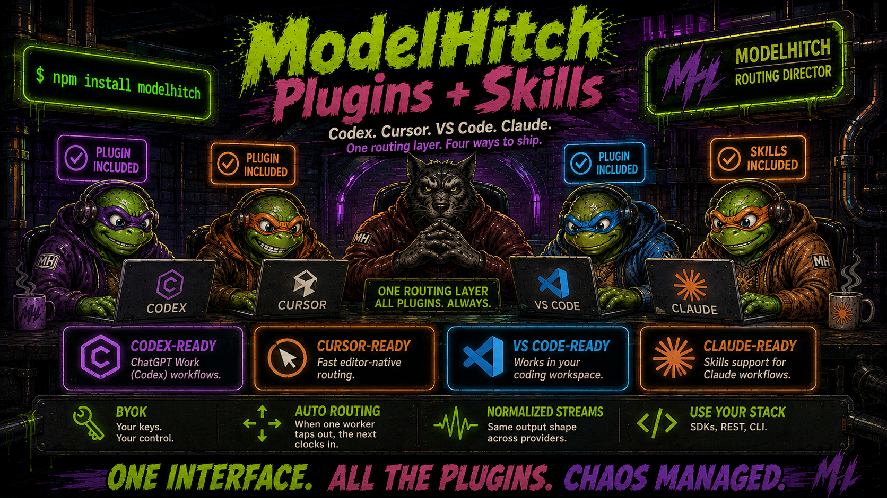

<p align="center">
  
</p>

<h1 align="center">ModelHitch Agent Plugin</h1>

<p align="center">
  <strong>One shared skill package. Four agent surfaces.</strong>
</p>

<p align="center">
  <a href="https://www.npmjs.com/package/modelhitch"></a>
  
  
  
  
</p>

This directory is the distributable ModelHitch plugin package. Codex, Cursor, VS Code, and
GitHub Copilot select their own manifest while sharing `skills/modelhitch/`.

## Package layout

```text
modelhitch/
├── plugin.json                 # Agent Plugins 1.0 / VS Code / Copilot
├── .codex-plugin/plugin.json   # Codex presentation manifest
├── .cursor-plugin/plugin.json  # Cursor presentation manifest
└── skills/modelhitch/          # Shared ModelHitch skill + reference
```

## What the skill covers

- npm and React integration
- BYOK credential storage and precedence
- normalized chat, streaming, and tool loops
- local multi-wire bridge operation
- provider/model routing and custom gateways
- auto-mode failover, usage, and cost telemetry
- mock-first verification and safe troubleshooting

## Install

### Codex

```bash
codex plugin marketplace add genoventures-labs/ModelHitch
codex plugin add modelhitch@modelhitch
```

### Cursor

Install ModelHitch from the Cursor Marketplace after approval. For local development, load this
directory with `cursor-agent --plugin-dir ./plugins/modelhitch` or copy it to
`~/.cursor/plugins/local/modelhitch`.

### VS Code and GitHub Copilot

```bash
copilot plugin marketplace add genoventures-labs/ModelHitch
copilot plugin install modelhitch@modelhitch
```

## Runtime note

The ModelHitch application library supports Node.js 18+. The packaged CLI bridge requires
Node.js 22.5+ because it enables SQLite usage persistence.
